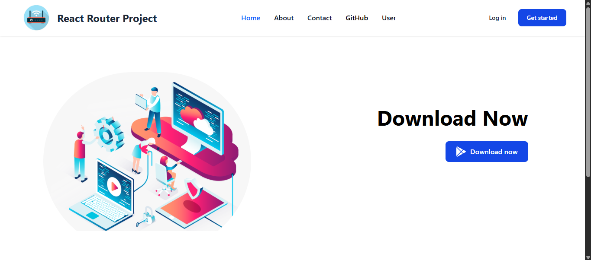

## 📸 Screenshot

# 🚦 React Router Project

🔗 **Live Demo:** [See it Live](https://react-router-project-lokendra.vercel.app/)

---

## ✅ Features & Concepts Covered:

- **Basic Routing**

  - `BrowserRouter`, `Routes`, and `Route` for core route structure

- **Nested Routes + Layout Routing**

  - Shared UI via layout component and `<Outlet />`

- **Dynamic Routing**

  - URL parameters using `:params` with `useParams()`

- **Navigation System**

  - Declarative links using `Link` and `NavLink` components

- **Loader & Data Fetching**
  - `useLoaderData()` for data pre-fetching
  - Real-time GitHub user data integration via API

---

## 🚀 Tech Stack

- **React** (Vite-based setup)
- **React Router DOM v6+**
- **Vercel** for hosting
- **GitHub API** for dynamic data

---

> Built with 💻 by Lokendra Verma
